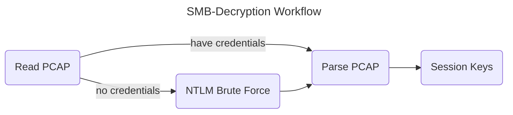

# SMB-Decryption

## Workflow

```mermaid
---
title: SMB-Decryption Workflow
---
flowchart LR
    a(Read PCAP)
    b(Parse PCAP)
    c(NTLM Brute Force)
    d(Session Keys)

    a-->|have credentials|b
    a-->|no credentials|c
    c-->b
    b-->d
```

- Read SMB3 conversations within pcap
  - Parse out session keys from pcap
  - 