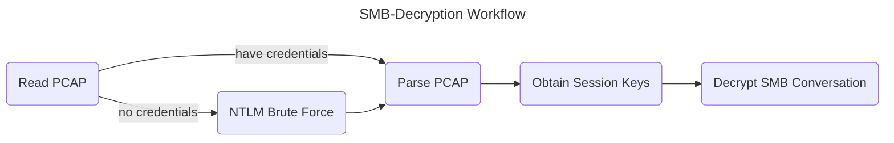

# SMB-Decryption

## Workflow

## TODO List
- [x] Read PCAP
- [x] Identify encrypted SMB3 sessions
  - See [Resources MS Docs: MS CIFS](#resources)
- [x] Pull SMB3 conversations from pcap
- [ ] Parse out relevant data for decryption from smb3 conversations
- [ ] Utilize relevant data to create session key
- [ ] Brute force NTLM to obtain credentials
- [ ] Decrypt conversation

## Resources
- [Message Analyzer Download](https://github.com/riverar/messageanalyzer-archive)
- [Microsoft Docs: MS-CIFS](https://learn.microsoft.com/en-us/openspecs/windows_protocols/ms-cifs/32b5d4b7-d90b-483f-ad6a-003fd110f0ec)